# PSOC&trade; 4: CY8CPROTO-041TP demo

This code example implements a low-power capacitive-sensing solution with the PSOC™ 4100T Plus device using the CY8CPROTO-041TP CAPSENSE™ Prototyping Kit.

This code example demonstrates the advanced features of the multi-sense converter low-power (MSCLP), fifth generation CAPSENSE™ block in PSOC™ 4100T Plus. This kit has onboard ambient light sensor (ALS) that detect changes in illuminance and capacitive sensors (a self-capacitance touch button, a mutual-capacitance touch button,  a proximity sensor, and a touchpad) that operate in an ultra-low-power mode and only respond to a valid finger touch. The kit has onboard LEDs to indicate different operations.

Use only the CY8CPROTO-041TP CAPSENSE™ kit for testing this code example.

[View this README on GitHub.](https://github.com/Infineon/mtb-example-cy8cproto-041tp-demo)

[Provide feedback on this code example.](https://cypress.co1.qualtrics.com/jfe/form/SV_1NTns53sK2yiljn?Q_EED=eyJVbmlxdWUgRG9jIElkIjoiQ0UyNDAzODAiLCJTcGVjIE51bWJlciI6IjAwMi00MDM4MCIsIkRvYyBUaXRsZSI6IlBTT0MmdHJhZGU7IDQ6IENZOENQUk9UTy0wNDFUUCBkZW1vIiwicmlkIjoieWFzaHZpIiwiRG9jIHZlcnNpb24iOiIzLjAuMCIsIkRvYyBMYW5ndWFnZSI6IkVuZ2xpc2giLCJEb2MgRGl2aXNpb24iOiJNQ0QiLCJEb2MgQlUiOiJJQ1ciLCJEb2MgRmFtaWx5IjoiUFNPQyJ9)


## Requirements

- [ModusToolbox&trade;](https://www.infineon.com/modustoolbox) v3.5 or later

> **Note:** This code example version requires ModusToolbox&trade; v3.5 and is not backward compatible with older versions.

- Board support package (BSP) minimum required version: 3.3.0
- Programming language: C
- Associated parts: [PSOC&trade; 4100T Plus](https://www.infineon.com/002-39671)


## Supported toolchains (make variable 'TOOLCHAIN')

- GNU Arm&reg; Embedded Compiler v11.3.1 (`GCC_ARM`) – Default value of `TOOLCHAIN`
- Arm&reg; Compiler v6.22 (`ARM`)
- IAR C/C++ Compiler v9.50.2 (`IAR`)


## Supported kits (make variable 'TARGET')

- PSOC&trade; 4100T Plus CAPSENSE&trade; Prototyping Kit (https://www.infineon.com/CY8CPROTO-041TP) (`CY8CPROTO-041TP`) – Default value of `TARGET`


## Hardware setup

This example uses the board's default configuration. See the kit user guide to ensure that the board is configured correctly to use VDD at 5V.


## Software setup

See the [ModusToolbox&trade; tools package installation guide](https://www.infineon.com/ModusToolboxInstallguide) for information about installing and configuring the tools package.


This example requires no additional software or tools.


## Using the code example


### Create the project

The ModusToolbox&trade; tools package provides the Project Creator as both a GUI tool and a command line tool.

<details><summary><b>Use Project Creator GUI</b></summary>

1. Open the Project Creator GUI tool.

   There are several ways to do this, including launching it from the dashboard or from inside the Eclipse IDE. For more details, see the [Project Creator user guide](https://www.infineon.com/ModusToolboxProjectCreator) (locally available at *{ModusToolbox&trade; install directory}/tools_{version}/project-creator/docs/project-creator.pdf*).

2. On the **Choose Board Support Package (BSP)** page, select a kit supported by this code example. See [Supported kits](#supported-kits-make-variable-target).

   > **Note:** To use this code example for a kit not listed here, you may need to update the source files. If the kit does not have the required resources, the application may not work.

3. On the **Select Application** page:

   a. Select the **Applications(s) Root Path** and the **Target IDE**.

   > **Note:** Depending on how you open the Project Creator tool, these fields may be pre-selected for you.

   b. Select this code example from the list by enabling its check box.

   > **Note:** You can narrow the list of displayed examples by typing in the filter box.

   c. (Optional) Change the suggested **New Application Name** and **New BSP Name**.

   d. Click **Create** to complete the application creation process.

</details>


<details><summary><b>Use Project Creator CLI</b></summary>

The 'project-creator-cli' tool can be used to create applications from a CLI terminal or from within batch files or shell scripts. This tool is available in the *{ModusToolbox&trade; install directory}/tools_{version}/project-creator/* directory.

Use a CLI terminal to invoke the 'project-creator-cli' tool. On Windows, use the command-line 'modus-shell' program provided in the ModusToolbox&trade; installation instead of a standard Windows command-line application. This shell provides access to all ModusToolbox&trade; tools. You can access it by typing "modus-shell" in the search box in the Windows menu. In Linux and macOS, you can use any terminal application.

The following example clones the mtb-example-cy8cproto-041tP-demo application with the desired name "CY8CPROTO_041TP_demo" configured for the *CY8CPROTO-041TP* BSP into the specified working directory, *C:/mtb_projects*:

   ```
   project-creator-cli --board-id CY8CPROTO-041TP --app-id mtb-example-cy8cproto-041tp-demo --user-app-name CY8CPROTO_041TP_demo --target-dir "C:/mtb_projects"
   ```


The 'project-creator-cli' tool has the following arguments:

Argument | Description | Required/optional
---------|-------------|-----------
`--board-id` | Defined in the <id> field of the [BSP](https://github.com/Infineon?q=bsp-manifest&type=&language=&sort=) manifest | Required
`--app-id`   | Defined in the <id> field of the [CE](https://github.com/Infineon?q=ce-manifest&type=&language=&sort=) manifest | Required
`--target-dir`| Specify the directory in which the application is to be created if you prefer not to use the default current working directory | Optional
`--user-app-name`| Specify the name of the application if you prefer to have a name other than the example's default name | Optional
<br>

> **Note:** The project-creator-cli tool uses the `git clone` and `make getlibs` commands to fetch the repository and import the required libraries. For details, see the "Project creator tools" section of the [ModusToolbox&trade; tools package user guide](https://www.infineon.com/ModusToolboxUserGuide) (locally available at {ModusToolbox&trade; install directory}/docs_{version}/mtb_user_guide.pdf).

</details>


### Open the project

After the project has been created, you can open it in your preferred development environment.


<details><summary><b>Eclipse IDE</b></summary>

If you opened the Project Creator tool from the included Eclipse IDE, the project will open in Eclipse automatically.

For more details, see the [Eclipse IDE for ModusToolbox&trade; user guide](https://www.infineon.com/MTBEclipseIDEUserGuide) (locally available at *{ModusToolbox&trade; install directory}/docs_{version}/mt_ide_user_guide.pdf*).

</details>


<details><summary><b>Visual Studio (VS) Code</b></summary>

Launch VS Code manually, and then open the generated *{project-name}.code-workspace* file located in the project directory.

For more details, see the [Visual Studio Code for ModusToolbox&trade; user guide](https://www.infineon.com/MTBVSCodeUserGuide) (locally available at *{ModusToolbox&trade; install directory}/docs_{version}/mt_vscode_user_guide.pdf*).

</details>


<details><summary><b>Keil µVision</b></summary>

Double-click the generated *{project-name}.cprj* file to launch the Keil µVision IDE.

For more details, see the [Keil µVision for ModusToolbox&trade; user guide](https://www.infineon.com/MTBuVisionUserGuide) (locally available at *{ModusToolbox&trade; install directory}/docs_{version}/mt_uvision_user_guide.pdf*).

</details>


<details><summary><b>IAR Embedded Workbench</b></summary>

Open IAR Embedded Workbench manually, and create a new project. Then select the generated *{project-name}.ipcf* file located in the project directory.

For more details, see the [IAR Embedded Workbench for ModusToolbox&trade; user guide](https://www.infineon.com/MTBIARUserGuide) (locally available at *{ModusToolbox&trade; install directory}/docs_{version}/mt_iar_user_guide.pdf*).

</details>


<details><summary><b>Command line</b></summary>

If you prefer to use the CLI, open the appropriate terminal, and navigate to the project directory. On Windows, use the command-line 'modus-shell' program; on Linux and macOS, you can use any terminal application. From there, you can run various `make` commands.

For more details, see the [ModusToolbox&trade; tools package user guide](https://www.infineon.com/ModusToolboxUserGuide) (locally available at *{ModusToolbox&trade; install directory}/docs_{version}/mtb_user_guide.pdf*).

</details>


## Operation

1. Connect the USB cable between the CY8CPROTO-041TP Kit and the PC, as shown in **Figure 1**.

   **Figure 1. Connecting the CY8CPROTO-041TP Kit with the PC**

   

2. Program the board using one of the following:

   <details><summary><b>Using Eclipse IDE</b></summary>

      1. Select the application project in the Project Explorer.

      2. In the **Quick Panel**, scroll down, and click **\<Application Name> Program (KitProg3_MiniProg4)**.
   </details>


   <details><summary><b>In other IDEs</b></summary>

   Follow the instructions in your preferred IDE.
   </details>


   <details><summary><b>Using CLI</b></summary>

     From the terminal, execute the `make program` command to build and program the application using the default toolchain to the default target. The default toolchain is specified in the application's Makefile but you can override this value manually:
      ```
      make program TOOLCHAIN=<toolchain>
      ```

      Example:
      ```
      make program TOOLCHAIN=GCC_ARM
      ```
   </details>

   After programming, the application starts automatically.

3. Touch any of the sensors with your finger; LEDs turn ON, indicating the activation of different CAPSENSE&trade; sensors.

   **Table 1. LED states for different sensors**

    Sensor touched | LED indication
   :---------------------| :-----
    CSD button    | LED3 turns ON
    CSX button    | LED2 turns ON
    CSD Touchpad  | LED2 and LED3 brightness changes based on touch position
    CSD Proximity | LED5 brightness changes based on proximity distance
    ALS Sensor    | LED6 brightness changes based on  change in illuminance 
    
    **Note:** When the ambient light sensor is exposed to fluorescent lighting, it may cause a flickering effect in LED6. Additionally, in Wake-on-Touch (WoT) mode, the LED will turn off completely.
    <br>

4. Verify that the application is transitioning to different power modes based on the user input conditions as follows:

   If there is no user activity for a certain time (ACTIVE_MODE_TIMEOUT_SEC = 10 s), the application transitions to Active-low refresh rate (ALR) mode. Here, the refresh rate is reduced to 32 Hz.
   
   Further non-activity for a certain time (ALR_MODE_TIMEOUT_SEC = 5 s) transitions the application to the lowest-power mode, called the Wake-on-Touch (WoT) mode, which scans the low-power widget at a low refresh rate (16 Hz).

   **Figure 2. Low-power mode state machine**

    


### Monitor data using CAPSENSE&trade; Tuner

1. Open the CAPSENSE&trade; Tuner from the **BSP Configurators** section in the IDE Quick Panel.

   You can also run the CAPSENSE&trade; tuner application standalone from *{ModusToolbox&trade; install directory}/ModusToolbox/tools_{version}/capsense-configurator/capsense-tuner*. In this case, after opening the application, select **File** > **Open** and then open the *design.cycapsense* file of the respective application, which is present in the *{Application root directory}/bsps/TARGET_APP_\<BSP-NAME>/config* folder.

   See the [ModusToolbox&trade; user guide](https://www.infineon.com/ModusToolboxUserGuide) (locally available at *{ModusToolbox install directory}/docs_{version}/mtb_user_guide.pdf*) for options to open the CAPSENSE&trade; tuner application using the CLI.

2. Ensure that the status LED is ON and not blinking; this indicates that the onboard KitProg3 is in CMSIS-DAP Bulk mode. See the [Firmware-loader](https://github.com/Infineon/Firmware-loader) to learn how to update the firmware and switch modes in KitProg3.

3. In the tuner application, click on the **Tuner Communication Setup** icon or select **Tools** > **Tuner Communication Setup** as shown in **Figure 3**.

   **Figure 3. Tuner communication setup**

   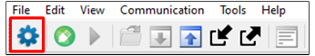 

4.  Select I2C under KitProg3 and configure it as follows:

      - I2C address: 8
      - Sub-address: 2 bytes
      - Speed (kHz): 400

      These are the same values set in the EZI2C resource as shown in **Figure 4**.

      **Figure 4. Tuner Communication Setup parameters**

      

5. Click **Connect** or select **Communication** > **Connect** to establish a connection.

   **Figure 5. Establish connection**

   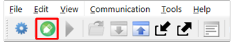

6. Click **Start** or select **Communication** > **Start** to begin data streaming from the device.

   **Figure 6. Start Tuner communication**

   

   The **Widget/Sensor Parameters** tab is updated with the parameters configured in the *CAPSENSE&trade; Configurator* window. The tuner displays the data from the sensor in the **Widget View** and **Graph View** tabs.

7. Set the **Read mode** to **Synchronized mode**. Navigate to the **Widget view** tab and notice that the touched widget is highlighted in **blue** as shown in **Figure 7**.

   **Figure 7. Widget view of the CAPSENSE&trade; Tuner**

   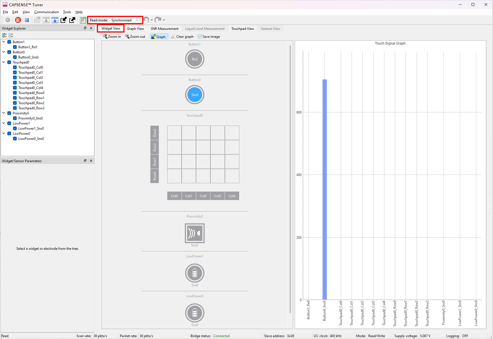

8. Go to the **Graph View** tab to view the raw count, baseline, difference count, and status of each sensor.
To view the sensor data for the buttons, select Button0_Sns0 or Button1_Rx0, respectively (see **Figure 8** and **Figure 9**). To view the touchpad sensor data, select Touchpad0 rows and columns (see **Figure 10**). To view the proximity sensor data, select Proximity0_Sns0 (see **Figure 11**)

   **Figure 8. Graph view of the CAPSENSE&trade; Tuner for the CSD button**

   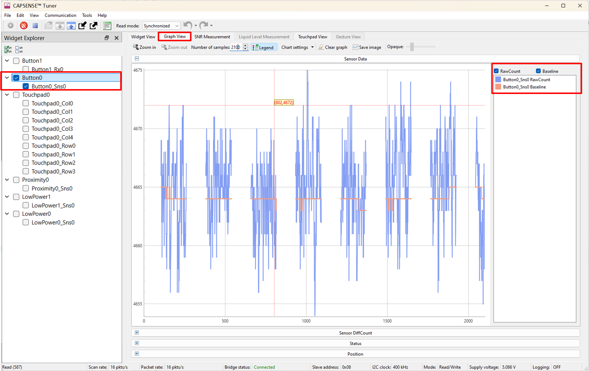
   
   <br>

   **Figure 9. Graph view of the CAPSENSE&trade; Tuner for the CSX button**

   
  
   <br>

   **Figure 10. Graph view of the CAPSENSE&trade; Tuner for the CSD Touchpad**

   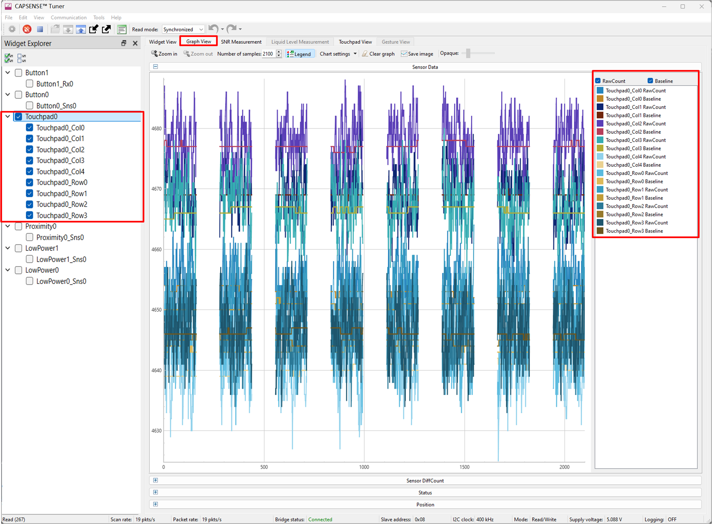

   <br>

   **Figure 11. Graph view of the CAPSENSE&trade; Tuner for the CSD Proximity**

   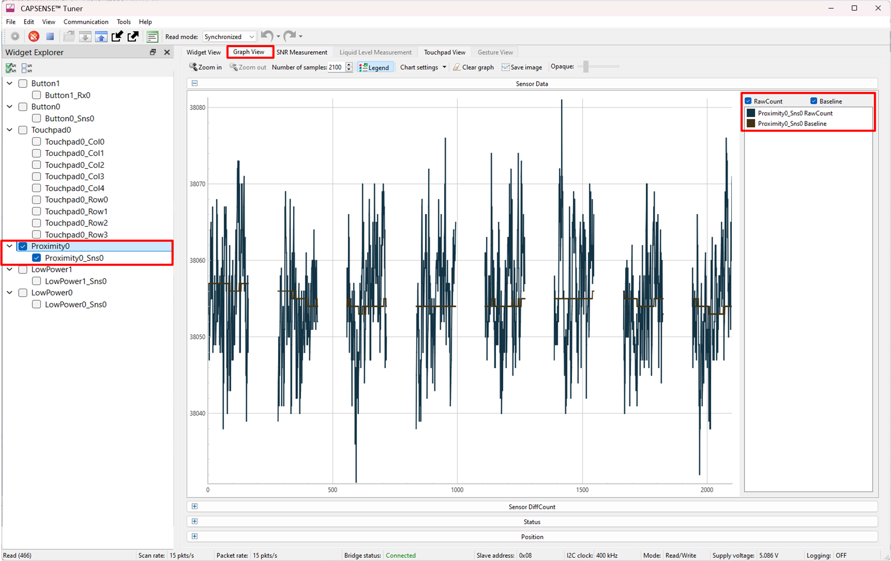

   Observe touchpad View tab to view the heatmap, that visualizes the finger movement (see **Figure 12**).
   <br>
   **Note:** Under Widget selection, enable Flip X-axis for proper visualization of finger movement on the touchpad.

   **Figure 12. Touchpad view of CAPSENSE&trade; Tuner**

   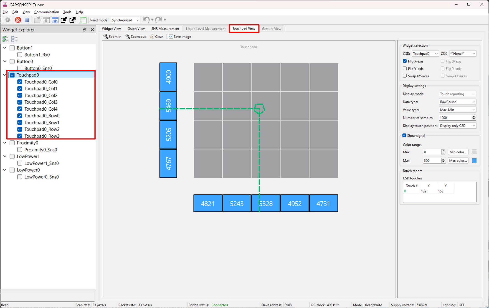


   Observe that the low-power widget (**LowPower0 & LowPower1**) raw count is plotted after the device completes the full frame scan (or detects a touch) in **WoT** mode and moves to **Active/ALR** mode.

   **Figure 13. Graph view of the CAPSENSE&trade; Tuner for the low-power widget 0**

   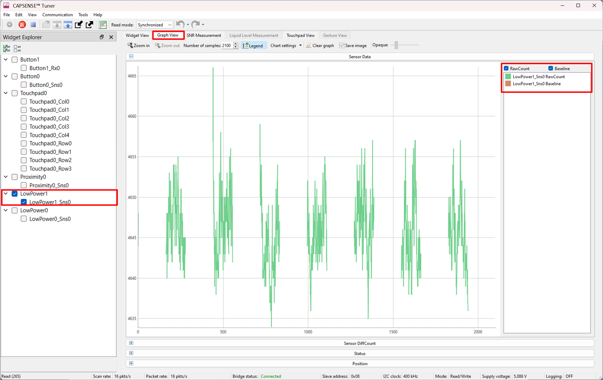


   **Figure 14. Graph view of the CAPSENSE&trade; Tuner for the low-power widget 1**

   

The tuning procedure, using the CAPSENSE&trade; Tuner for specific widgets is explained in the corresponding code examples mentioned in the [Tuning parameters](#tuning-parameters) section. 

The Code Example also explains the scan time and process time measurements.
 
 
## Operation at other voltages

CY8CPROTO-041TP Kit supports operating voltages of 1.8 V, 3.3 V and 5 V. See the Kit user guide to set the preferred operating voltage and refer to the section [Setup the VDDA supply voltage ](#set-up-the-vdda-supply-voltage).

The functionalities of this application is optimally tuned for 5 V. Observe that the basic functionalities work across other voltages.

For better performance, it is recommended to tune the application at the preferred voltage. 


## Measure current at different power modes

1. Disable the run-time measurement, LED, and tuner macros to measure the current used for CAPSENSE&trade; sensing in each power mode in *main.c* as follows:

   ```
      #define ENABLE_RUN_TIME_MEASUREMENT      (0u)
      
      #define ENABLE_PWM_LED                   (0u)

      #define ENABLE_TUNER                     (0u)
    ```
    
2. Disable the self-test library from the CAPSENSE&trade; configurator as shown in **Figure 15**.

   **Figure 15. Disable self-test library**

   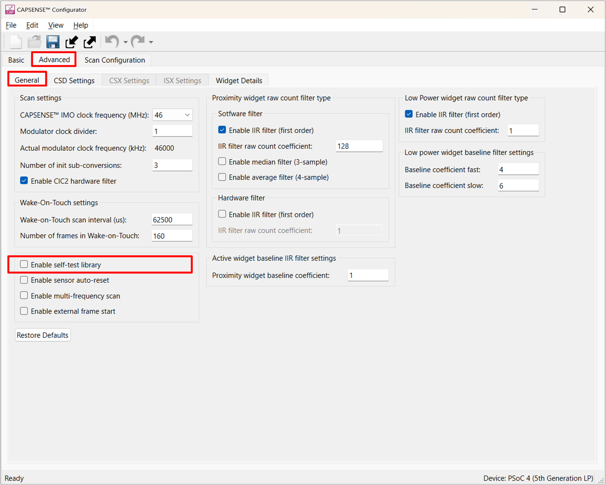

4.  To evaluate the low-power feature of the device, connect the kit to a Power Analyzer (for example, KEYSIGHT - N6705C) using a current measure header, as shown in **Figure 16**.

    **Figure 16. Power analyzer connection**

    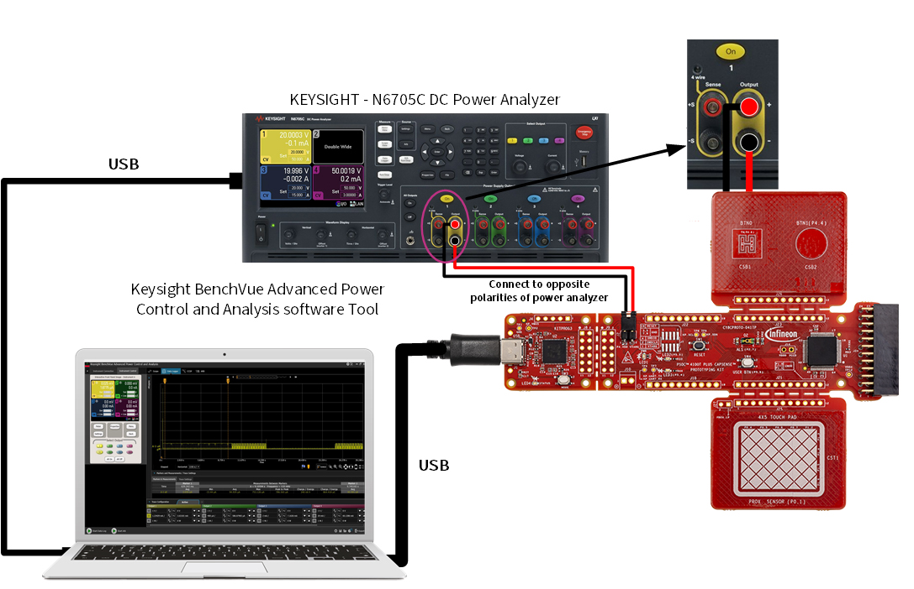

5. Use "Keysight BenchVue Advanced Power Control and Analysis" software to control the power analyzer device through the PC.

6. Select the **Current Measure** option from the Instrument Control setup. Select and turn ON the output channel, as shown in **Figure 17**.

   **Figure 17. Current measurement setup**

   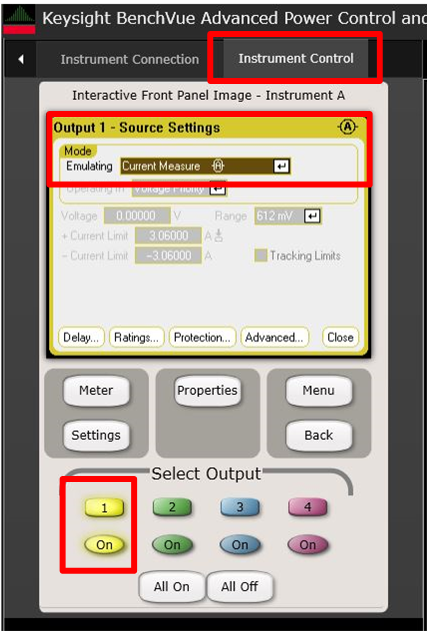

7. Capture the data using the **Data logger** option from the tool. The average current consumption is measured using cursors on each power mode, as shown in **Figure 18**.

   **Figure 18. Current measurement**

   

After reset, the application transitions to a low-power state if there is no button touch detection, in order to reduce power consumption, as shown in  **Figure 19**.

   **Figure 19. Power mode transition - no user activity**
   
   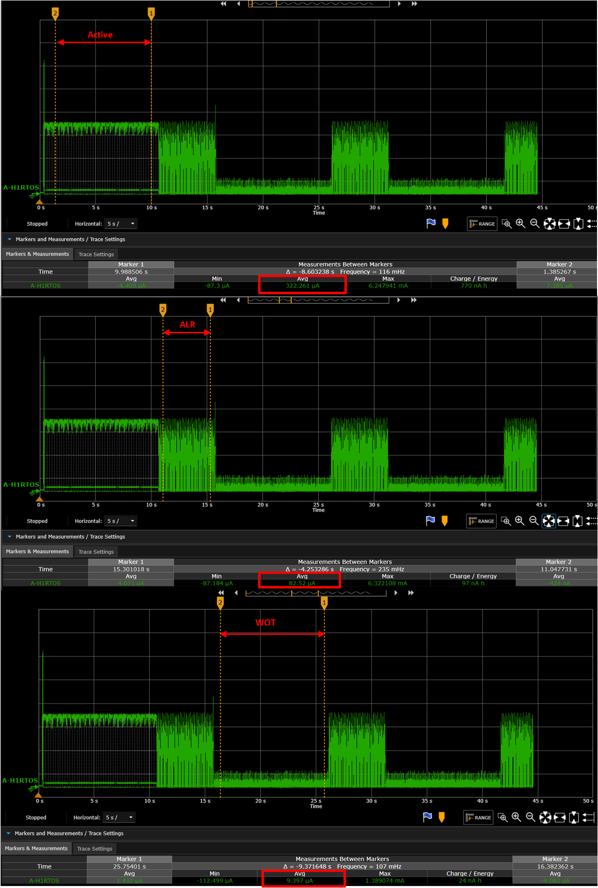

If there is touch detection while in low-power state, the application transitions to Active mode with the highest refresh rate as shown in **Table 2**.

**Table 2. Measured current for different modes**

Power mode   |Refresh rate (Hz) | Current consumption (µA)
:--------------------------|:-----:|:-----:
Active    |128 |322 
Active-low refresh rate <br>(ALR)|32 |82
Wake-on-Touch <br>(WoT)|16 |9

> **Note:** Captured current numbers with SAR ADC enabled only in CAPSENSE™ device configurator.
    
<br>


## Tuning procedure and parameters

<details><summary><b>Create custom BSP for your board</b></summary>

1. Follow the steps shown in [ModusToolbox&trade; BSP Assistant user guide](https://www.infineon.com/ModusToolboxBSPAssistant) to create a custom BSP for your board having any device. In this code example, it is created for the **CY8C4147AZQ-T495** device.

2. Open the *design.modus* file from *{Application root directory}/bsps/TARGET_APP_\<BSP-NAME>/config* folder obtained in the previous step and enable CAPSENSE&trade; to get the *design.cycapsense* file. CAPSENSE&trade; configuration can then be started from scratch as follows.
</details>

> **Note:** See the section "Selecting CAPSENSE&trade; hardware parameters" in [AN85951 - PSOC&trade; 4 and PSOC&trade; 6 MCU CAPSENSE&trade; design guide](https://www.infineon.com/AN85951) to learn about the considerations for selecting each parameter value. In addition, see the section "Low-power Widget parameters" in [AN234231 – PSOC™ 4 CAPSENSE™ ultra-low-power capacitive sensing techniques](https://www.infineon.com/AN234231) for more details about the considerations for parameter values specific to low-power widgets.

This code example has the optimum tuning parameters for all the sensors. 
See the following code examples that describe the tuning procedure for different sensors:

1. [CE238886](https://github.com/Infineon/mtb-example-psoc4-msclp-low-power-csd-button) for tuning the low-power widget and self-capacitance button
2. [CE238820](https://github.com/Infineon/mtb-example-psoc4-msclp-low-power-csx-button) for mutual-capacitance button tuning procedure
3. [CE240430](https://github.com/Infineon/mtb-example-psoc4-msclp-low-power-csd-touchpad) for self-capacitance touchpad tuning procedure
4. [CE238882](https://github.com/Infineon/mtb-example-psoc4-msclp-low-power-csd-proximity) for self-capacitance proximity tuning procedure


## Debugging

You can debug the example to step through the code.

<details><summary><b>In Eclipse IDE</b></summary>

Use the **\<Application Name> Debug (KitProg3_MiniProg4)** configuration in the **Quick Panel**. For details, see the "Program and debug" section in the [Eclipse IDE for ModusToolbox&trade; user guide](https://www.infineon.com/MTBEclipseIDEUserGuide).


</details>


<details><summary><b>In other IDEs</b></summary>

Follow the instructions in your preferred IDE.

</details>


## Design and implementation

The design has a ratio metric implementation of the following sensors:
- Two Wake-on-Touch widget (3 elements), also called "Low-power Widget"
- One self-capacitance button widget (1 element)
- One mutual-capacitance button widget (2 elements)
- One Touchpad widget (9 elements)

Following are the four LEDs used in this project: 
- LED2 shows the CSX button touch status: It turns ON when touched and turns OFF when the finger is lifted.
- LED3 shows the CSD button touch status: It turns ON when touched and turns OFF when the finger is lifted. 
- LED2 & LED3 shows the touchpad status: It's brightness changes based on the finger position.
- LED5 shows the proximity status: It's brightness changes based on the hand position.
- LED6 shows the ambient light sensor : It's brightness changes based on  change in illuminance .

There are three power states defined for this project:

- Active mode
- Active-low refresh rate (**ALR**) mode
- Wake-on-Touch (**WoT**) mode

After reset, the device is in Active mode, and scans the regular CAPSENSE&trade; widgets with a high refresh rate (**128 Hz**). If user activity is detected in any other mode, the device is transferred to Active mode to provide the best user interface experience. This mode has the highest power consumption; therefore, the design should reduce the time spent in Active mode.

If there is no user activity for a certain period of time (`ACTIVE_MODE_TIMEOUT_SEC` = 10 s), the application transitions to ALR mode. Here, the refresh rate is reduced to **32 Hz**; and hence this mode acts as an intermediate state before moving to the lowest-power mode (WoT mode). This mode can also be used for periodically updating the baselines of sensors while there is no user activity for a long time.

Further non-activity for a certain time span (`ALR_MODE_TIMEOUT_SEC` = 5 s) transitions the application to the lowest-power mode, called the **Wake-on-Touch** mode, which scans the low-power widget at a low refresh rate (**16 Hz**) and processes the results without CPU intervention.

> **Note:** An internal low-power timer (MSCLP timer) is available in CAPSENSE&trade; MSCLP hardware to set the refresh rate for each power mode as follows:

- For Active and ALR modes: Use the `Cy_CapSense_ConfigureMsclpTimer()` function
- For WoT mode: Use the Wake-on-Touch scan interval in CAPSENSE&trade; configurator

Different power modes and transition conditions for a typical use case are shown in **Figure 21**.

**Figure 20. State machine showing different power states of the device**


The project uses the [CAPSENSE&trade; middleware](https://github.com/Infineon/capsense) (see ModusToolbox&trade; user guide for more details on selecting a middleware). See [AN85951 - PSOC&trade; 4 and PSOC&trade; 6 MCU CAPSENSE&trade; design guide](https://www.infineon.com/AN85951) for more details on CAPSENSE&trade; features and usage.

The [ModusToolbox&trade;](https://www.infineon.com/modustoolbox) provides a GUI-based tuner application for debugging and tuning the CAPSENSE&trade; system. The CAPSENSE&trade; tuner application works with EZI2C and UART communication interfaces. This project has an SCB block configured in EZI2C mode to establish communication with the onboard KitProg, which in turn enables reading the CAPSENSE&trade; raw data using the CAPSENSE&trade; Tuner. See [EZI2C Peripheral settings](#resources-and-settings).

The CAPSENSE&trade; data structure that contains the CAPSENSE&trade; raw data is exposed to the CAPSENSE&trade; Tuner by setting up the I2C communication data buffer with the CAPSENSE&trade; data structure. This enables the tuner to access the CAPSENSE&trade; raw data for tuning and debugging CAPSENSE&trade;.


### Set up the VDDA supply voltage 

1. Open **Device Configurator** from the Quick Panel.

2. Go to the **System** tab, select the **Power** resource, and set the VDDA value under **Operating conditions** as shown in **Figure 22**.

   **Figure 21. Setting the VDDA supply in System tab of Device Configurator**

   


### Resources and settings

**Figure 22. EZI2C settings**

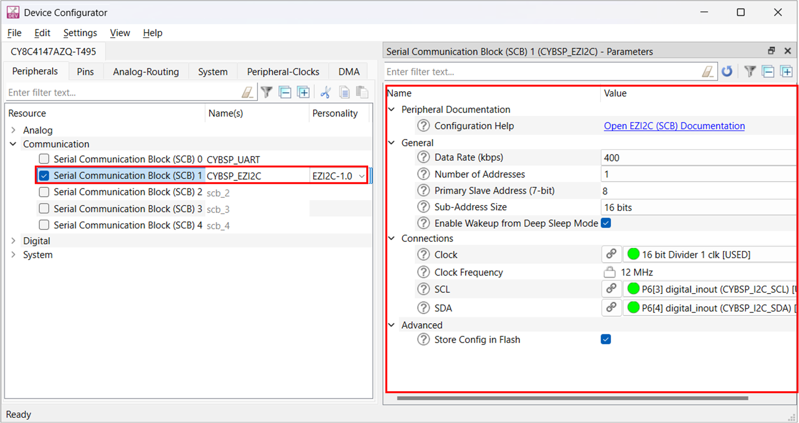


**Figure 23. PWM settings**

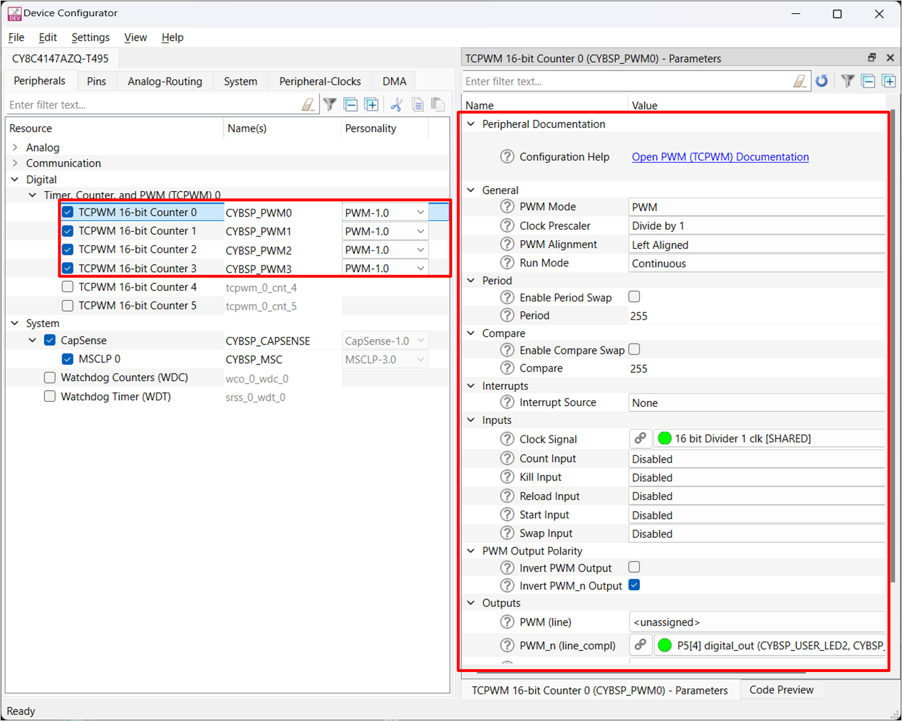


**Table 3. Application resources**

 Resource  |  Alias/object     |    Purpose
 :-------- | :-------------    | :------------
 SCB (I2C) (PDL) | CYBSP_EZI2C          | EZI2C slave driver to communicate with CAPSENSE&trade; Tuner
 CAPSENSE&trade; | CYBSP_MSC | CAPSENSE&trade; driver to interact with the MSC hardware and interface the CAPSENSE&trade; sensors
 LED2| CYBSP_USER_LED1,CYBSP_LED2  | To show the csx button and touchpad operation
 LED3| CYBSP_USER_LED2, CYBSP_LED3 | To show the csd button and touchpad operation
 LED5| CYBSP_USER_LED3, CYBSP_LED5 | To show the proximity operation
 LED6| CYBSP_USER_LED4, CYBSP_LED6 | To show the ALS operation

</details>
<br>


## Firmware flow

**Figure 24. Firmware flowchart**

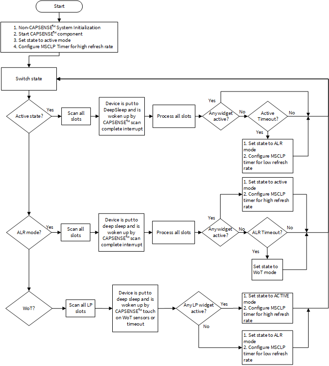


## Related resources

Resources  | Links
-----------|----------------------------------
Application notes | [AN79953](https://www.infineon.com/AN79953) – Getting started with PSOC&trade; 4 <br>  [AN234231](https://www.infineon.com/AN234231) – PSOC&trade; 4 – PSOC™ 4 CAPSENSE™ ultra-low-power capacitive sensing techniques <br> [AN85951](https://www.infineon.com/AN85951) – PSOC™ 4 and PSOC™ 6 MCU CAPSENSE™ design guide
Code examples  | [Using ModusToolbox&trade;](https://github.com/Infineon/Code-Examples-for-ModusToolbox-Software) on GitHub
Device documentation |  [PSOC&trade; 4 datasheets](https://www.infineon.com/cms/en/search.html?intc=searchkwr-return#!view=downloads&term=psoc%204&doc_group=Data%20Sheet) <br>[PSOC&trade; 4 technical reference manuals](https://www.infineon.com/cms/en/search.html#!term=psoc%204%20technical%20reference%20manual&view=all)
Development kits | Select your kits from the [Evaluation board finder](https://www.infineon.com/cms/en/design-support/finder-selection-tools/product-finder/evaluation-board).
Libraries on GitHub  | [mtb-pdl-cat2](https://github.com/Infineon/mtb-pdl-cat2) – PSOC&trade; 4 Peripheral Driver Library (PDL)
Middleware on GitHub  | [CAPSENSE&trade;](https://github.com/Infineon/capsense) – CAPSENSE&trade; library and documents
Tools  | [ModusToolbox&trade;](https://www.infineon.com/modustoolbox) – ModusToolbox&trade; software is a collection of easy-to-use libraries and tools enabling rapid development with Infineon MCUs for applications ranging from wireless and cloud-connected systems, edge AI/ML, embedded sense and control, to wired USB connectivity using PSOC&trade; Industrial/IoT MCUs, AIROC&trade; Wi-Fi and Bluetooth&reg; connectivity devices, XMC&trade; Industrial MCUs, and EZ-USB&trade;/EZ-PD&trade; wired connectivity controllers. ModusToolbox&trade; incorporates a comprehensive set of BSPs, HAL, libraries, configuration tools, and provides support for industry-standard IDEs to fast-track your embedded application development.
<br>


## Other resources

Infineon provides a wealth of data at [www.infineon.com](https://www.infineon.com) to help you select the right device, and quickly and effectively integrate it into your design.


## Document history

Document title: CE240380 – *PSOC&trade; 4: CY8CPROTO-041TP demo*

 Version | Description of change
 ------- | ---------------------
 1.0.0   | New code example
 2.0.0   | Major update to support ModusToolbox&trade; v3.3. This version is not backward compatible with previous versions of ModusToolbox&trade;   
 2.1.0   | README and configuration update
 3.0.0   | Major update to support ModusToolbox™ v3.5. This version is not backward compatible with previous versions of ModusToolbox™
<br>


All referenced product or service names and trademarks are the property of their respective owners.

The Bluetooth&reg; word mark and logos are registered trademarks owned by Bluetooth SIG, Inc., and any use of such marks by Infineon is under license.


---------------------------------------------------------

© Cypress Semiconductor Corporation, 2024. This document is the property of Cypress Semiconductor Corporation, an Infineon Technologies company, and its affiliates ("Cypress").  This document, including any software or firmware included or referenced in this document ("Software"), is owned by Cypress under the intellectual property laws and treaties of the United States and other countries worldwide.  Cypress reserves all rights under such laws and treaties and does not, except as specifically stated in this paragraph, grant any license under its patents, copyrights, trademarks, or other intellectual property rights.  If the Software is not accompanied by a license agreement and you do not otherwise have a written agreement with Cypress governing the use of the Software, then Cypress hereby grants you a personal, non-exclusive, nontransferable license (without the right to sublicense) (1) under its copyright rights in the Software (a) for Software provided in source code form, to modify and reproduce the Software solely for use with Cypress hardware products, only internally within your organization, and (b) to distribute the Software in binary code form externally to end users (either directly or indirectly through resellers and distributors), solely for use on Cypress hardware product units, and (2) under those claims of Cypress's patents that are infringed by the Software (as provided by Cypress, unmodified) to make, use, distribute, and import the Software solely for use with Cypress hardware products.  Any other use, reproduction, modification, translation, or compilation of the Software is prohibited.
<br>
TO THE EXTENT PERMITTED BY APPLICABLE LAW, CYPRESS MAKES NO WARRANTY OF ANY KIND, EXPRESS OR IMPLIED, WITH REGARD TO THIS DOCUMENT OR ANY SOFTWARE OR ACCOMPANYING HARDWARE, INCLUDING, BUT NOT LIMITED TO, THE IMPLIED WARRANTIES OF MERCHANTABILITY AND FITNESS FOR A PARTICULAR PURPOSE.  No computing device can be absolutely secure.  Therefore, despite security measures implemented in Cypress hardware or software products, Cypress shall have no liability arising out of any security breach, such as unauthorized access to or use of a Cypress product. CYPRESS DOES NOT REPRESENT, WARRANT, OR GUARANTEE THAT CYPRESS PRODUCTS, OR SYSTEMS CREATED USING CYPRESS PRODUCTS, WILL BE FREE FROM CORRUPTION, ATTACK, VIRUSES, INTERFERENCE, HACKING, DATA LOSS OR THEFT, OR OTHER SECURITY INTRUSION (collectively, "Security Breach").  Cypress disclaims any liability relating to any Security Breach, and you shall and hereby do release Cypress from any claim, damage, or other liability arising from any Security Breach.  In addition, the products described in these materials may contain design defects or errors known as errata which may cause the product to deviate from published specifications. To the extent permitted by applicable law, Cypress reserves the right to make changes to this document without further notice. Cypress does not assume any liability arising out of the application or use of any product or circuit described in this document. Any information provided in this document, including any sample design information or programming code, is provided only for reference purposes.  It is the responsibility of the user of this document to properly design, program, and test the functionality and safety of any application made of this information and any resulting product.  "High-Risk Device" means any device or system whose failure could cause personal injury, death, or property damage.  Examples of High-Risk Devices are weapons, nuclear installations, surgical implants, and other medical devices.  "Critical Component" means any component of a High-Risk Device whose failure to perform can be reasonably expected to cause, directly or indirectly, the failure of the High-Risk Device, or to affect its safety or effectiveness.  Cypress is not liable, in whole or in part, and you shall and hereby do release Cypress from any claim, damage, or other liability arising from any use of a Cypress product as a Critical Component in a High-Risk Device. You shall indemnify and hold Cypress, including its affiliates, and its directors, officers, employees, agents, distributors, and assigns harmless from and against all claims, costs, damages, and expenses, arising out of any claim, including claims for product liability, personal injury or death, or property damage arising from any use of a Cypress product as a Critical Component in a High-Risk Device. Cypress products are not intended or authorized for use as a Critical Component in any High-Risk Device except to the limited extent that (i) Cypress's published data sheet for the product explicitly states Cypress has qualified the product for use in a specific High-Risk Device, or (ii) Cypress has given you advance written authorization to use the product as a Critical Component in the specific High-Risk Device and you have signed a separate indemnification agreement.
<br>
Cypress, the Cypress logo, and combinations thereof, ModusToolbox, PSOC, CAPSENSE, EZ-USB, F-RAM, and TRAVEO are trademarks or registered trademarks of Cypress or a subsidiary of Cypress in the United States or in other countries. For a more complete list of Cypress trademarks, visit www.infineon.com. Other names and brands may be claimed as property of their respective owners.
